# Rode Clone

## Table of Contents
* [Overview](#overview)
* [Process](#process)
* [References](#references)
* [Author](#author)

## Overview
[Rode](https://rode.com/en) Microphones are recognized across the world for their high-quality build and sound. This project replica of Rode.

### Screenshots
#### 1) Desktop
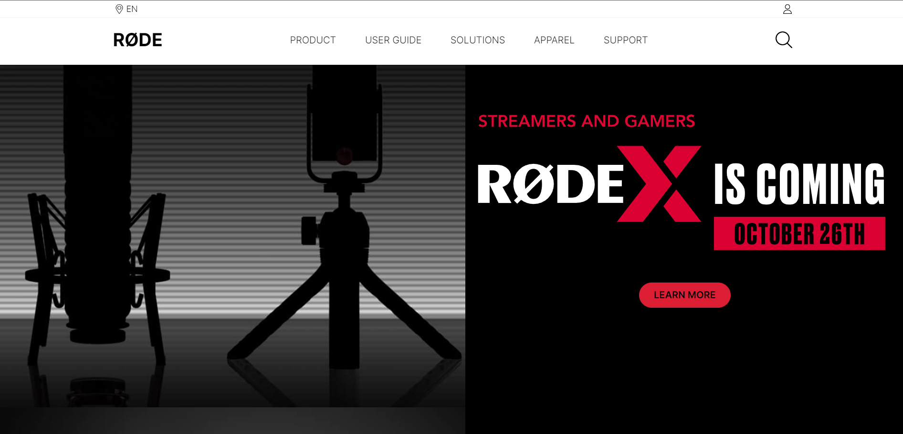
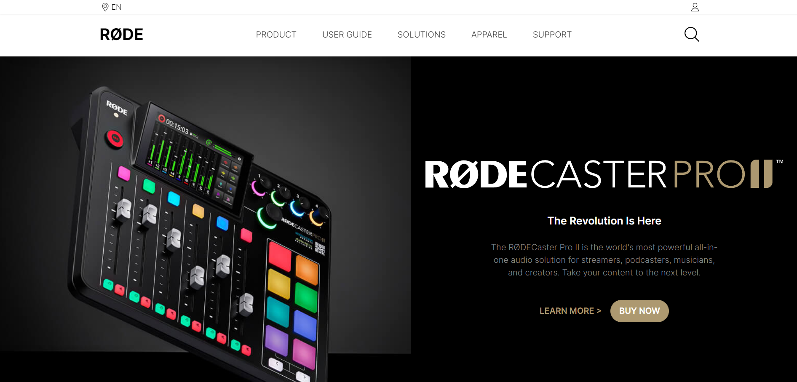
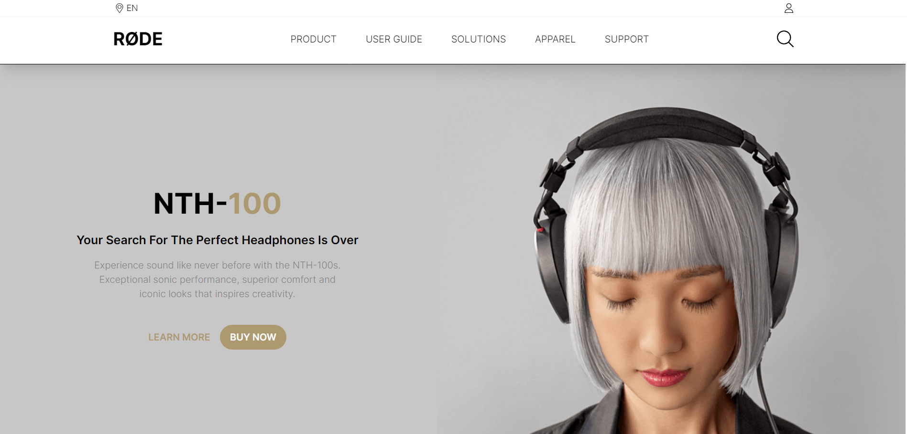
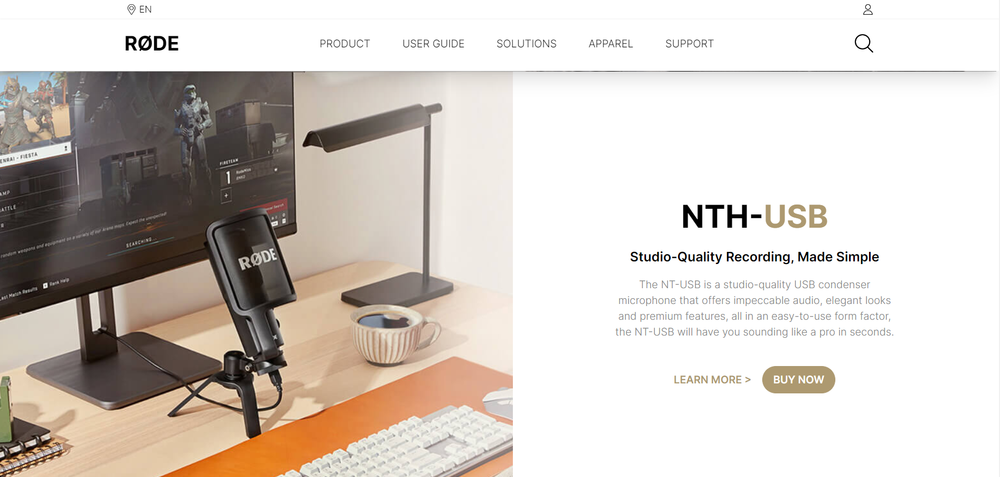
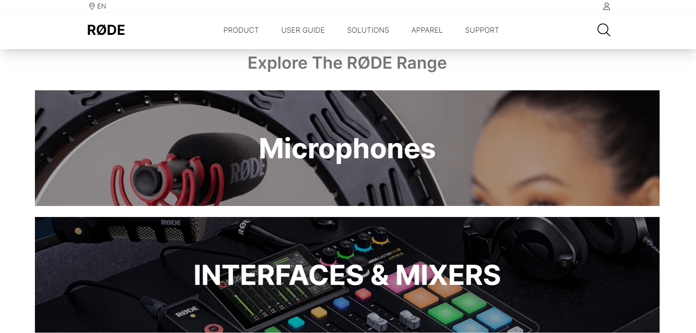
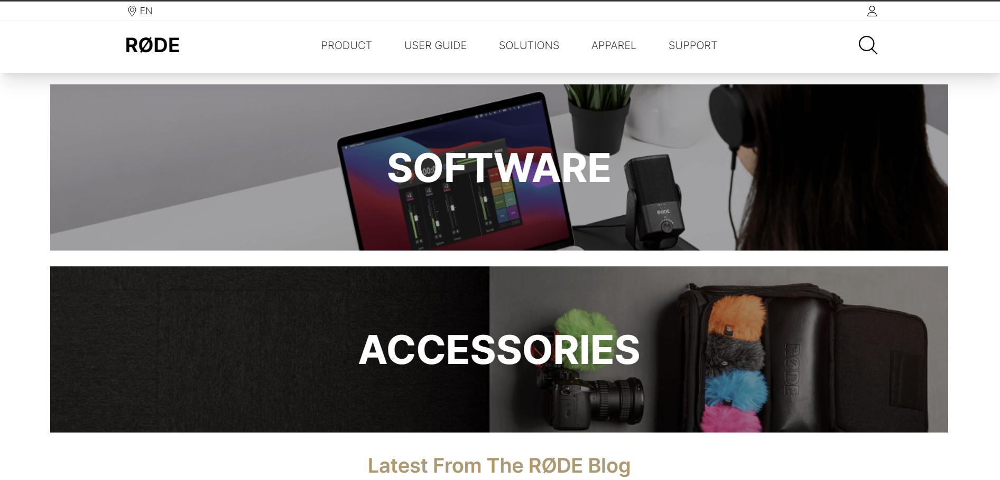
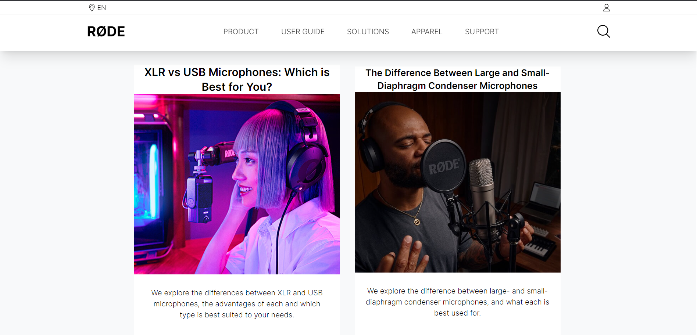
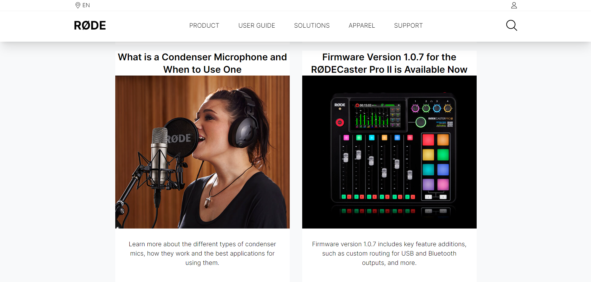
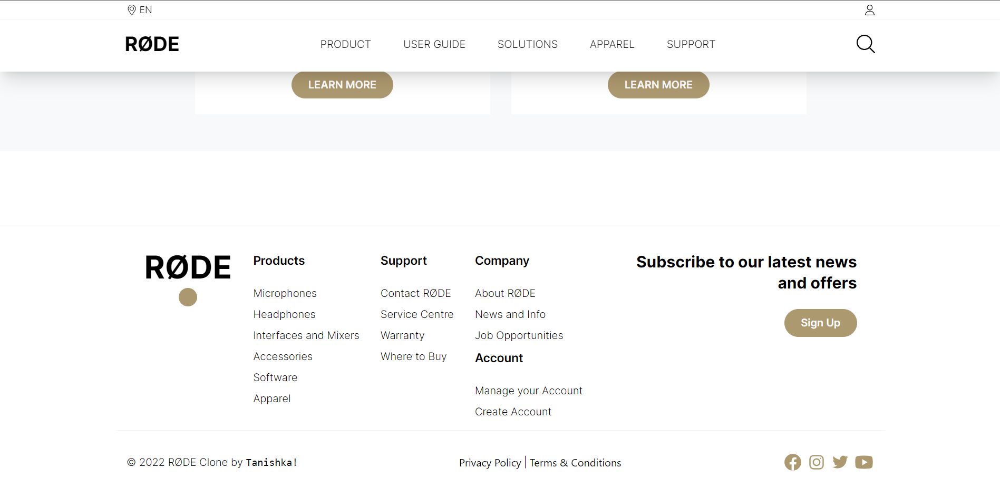

#### 2) Mobile  

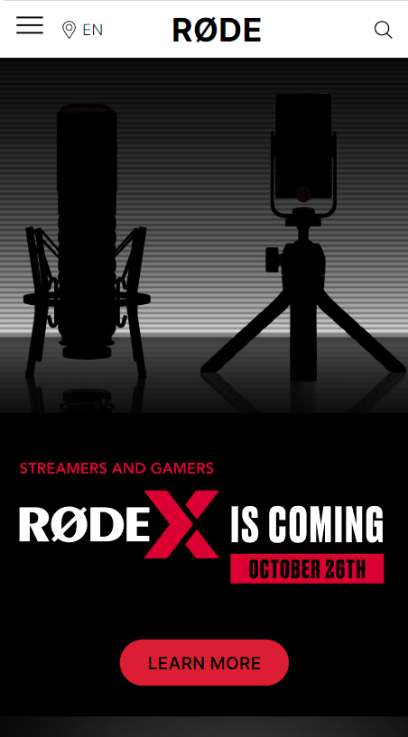
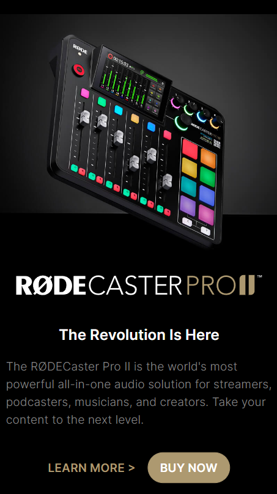
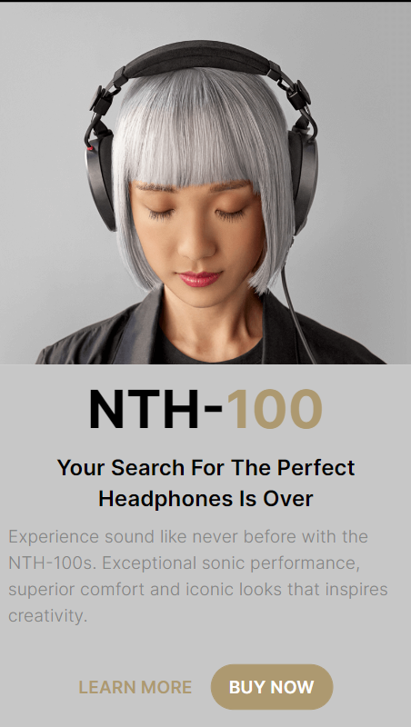
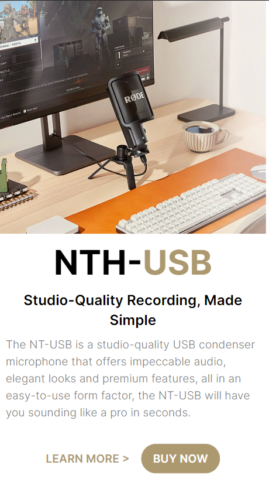
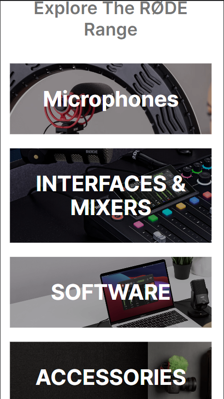

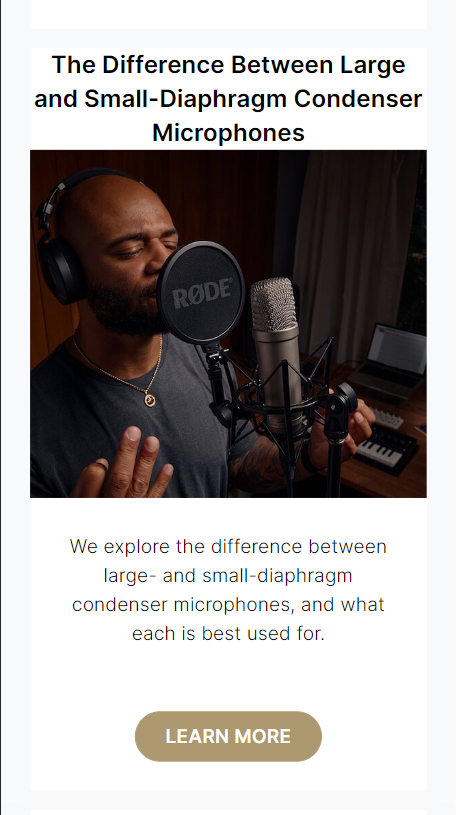
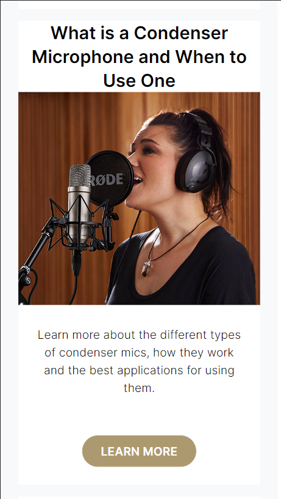
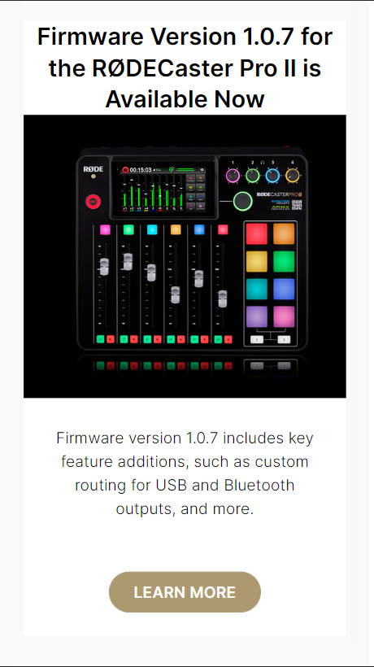
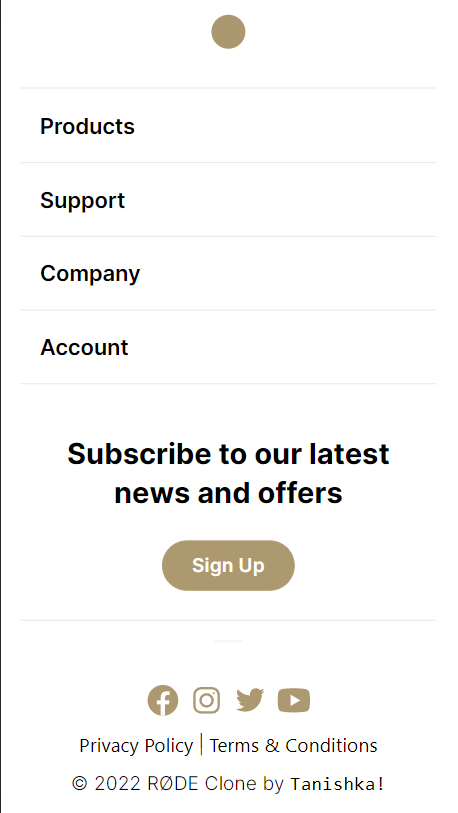

### You can watch Live demo [_here_](https://rode-clone-wine.vercel.app/).

## Process

### Built With
- HTML
- CSS
- Tailwind CSS

### What I Learned
- This is my very first reponsive website (apart from small card projects), I learned to use tailwind CSS properly.
- I learned to make a hamburger menu, which is only visible on small screens like smartphone or tablet. 

## References
- [TailwindCSS](https://tailwindcss.com/)
- [MDN](https://developer.mozilla.org/en-US/)
- [w3schools](https://www.w3schools.com/)

## Author

[Linkedin](https://www.linkedin.com/in/tanishka-makode-484384251/)

[Twitter](https://twitter.com/the_code_witch)

[Instagram](https://www.instagram.com/the_code_witch/?next=%2F)

makodetanishka@gmail.com
